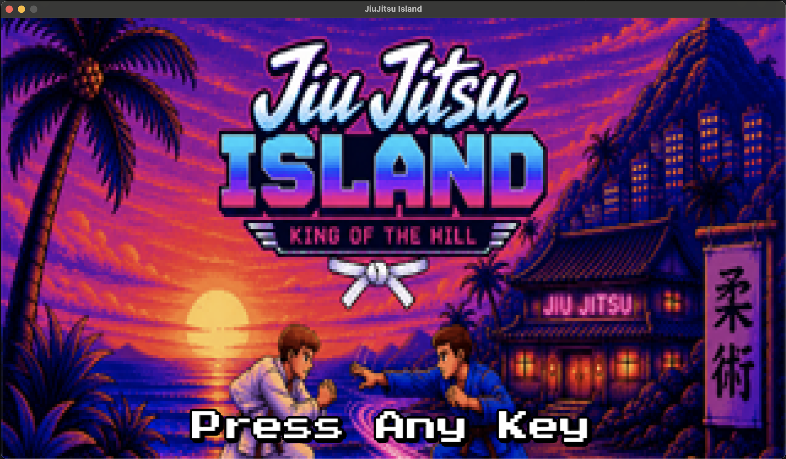
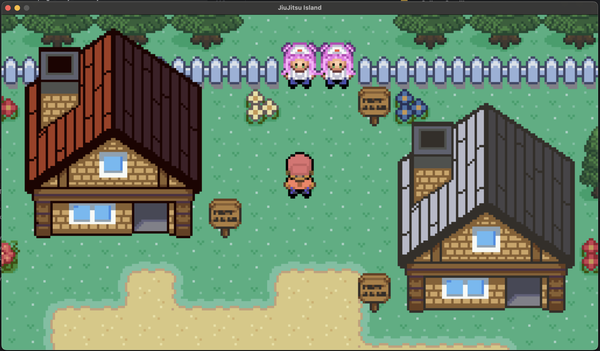
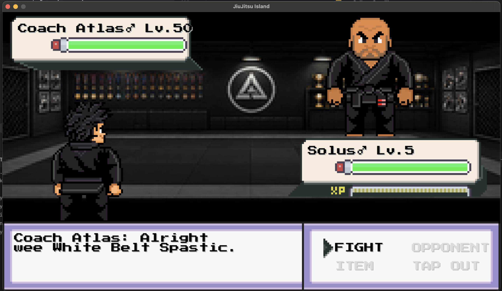
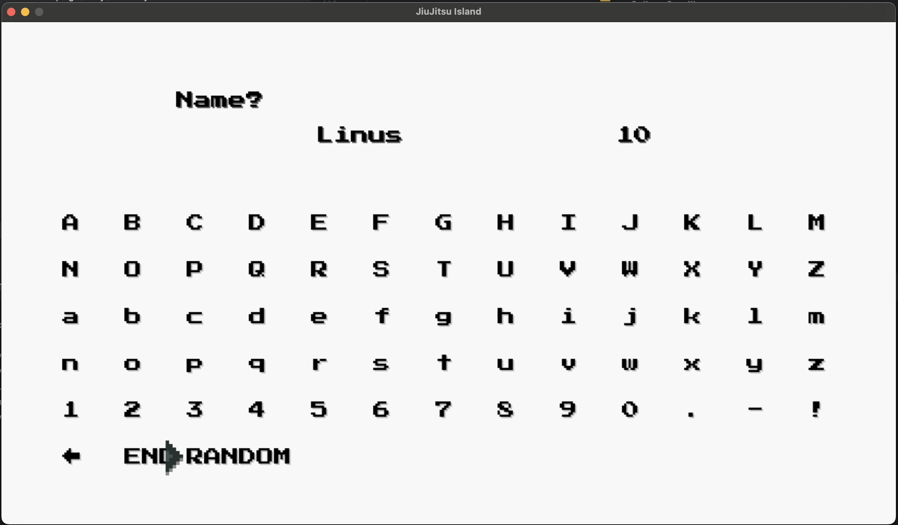

# 🥋 JiuJitsu Island RPG

<p align="center">
  
</p>

<p align="center">

# Become the King Of The Hill Champion

A retro-inspired Brazilian Jiu-Jitsu RPG where you train, compete, master authentic techniques and battle your way from **White Belt to Black Belt**.

🌐 **https://jiujitsuislandrpg.com**

</p>

---

# 🥋 About

JiuJitsu Island RPG is a story-driven pixel-art RPG inspired by classic handheld adventures and a passion for Brazilian Jiu-Jitsu.

Begin your journey as a complete beginner and travel across the island, training under experienced coaches, competing against rival academies, learning authentic techniques and uncovering the mystery surrounding Coach Atlas and the King Of The Hill Corporation.

From local gyms and busy towns to championship arenas and memorable rivals, every part of the island has been designed to capture the humour, community and spirit of Brazilian Jiu-Jitsu.

Whether you're a lifelong grappler or someone who has never stepped on the mats, JiuJitsu Island combines humour, adventure and authentic BJJ culture into a unique retro RPG experience.

---

# 🌍 Official Links

### 🌐 Website

https://jiujitsuislandrpg.com

### 📘 Facebook

https://www.facebook.com/JiuJitsuIslandRPG/

### 📸 Instagram

https://www.instagram.com/JiuJitsuIslandRPG

---

# 🎮 Features

- 🥋 Progress from White Belt to Black Belt
- ⚔️ Tactical turn-based combat
- 🧠 Learn authentic Brazilian Jiu-Jitsu techniques
- 🌍 Explore towns, academies and tournaments
- 🏆 Become the King Of The Hill Champion
- 🛍️ Visit shops and discover hidden collectibles
- 💬 Hundreds of handcrafted NPC interactions
- 📖 Story-driven campaign inspired by BJJ culture
- 😂 Humorous dialogue inspired by real-life grappling
- 🎵 Retro-inspired pixel-art presentation
- 🎮 Keyboard and controller support
- ❤️ Built with the open-source Tuxemon engine

---

# 📸 Screenshots

## 🏝️ Title Screen

<p align="center">

</p>

---

## 🌍 Explore Trial Class Town

<p align="center">

</p>

---

## 🥋 Face Coach Atlas

<p align="center">

</p>

---

## 👤 Character Creation

<p align="center">

</p>

---

# 🚀 Running the Game

Clone the repository

```bash
git clone https://github.com/<YOUR_GITHUB_USERNAME>/JiuJitsuIslandRPG.git
cd JiuJitsuIslandRPG
```

Create a virtual environment

```bash
python3 -m venv .venv
source .venv/bin/activate
```

Install dependencies

```bash
pip install -r requirements.txt
```

Launch the game

```bash
python3 run_tuxemon.py
```

---

# 🛣️ Development Progress

## ✅ Current Features

- Story-driven campaign
- White Belt to Black Belt progression
- Tactical turn-based combat
- Authentic Brazilian Jiu-Jitsu techniques
- Multiple explorable towns
- Tournament progression
- Hundreds of unique NPCs
- Story cutscenes
- Character customisation
- Hidden collectibles
- Side quests
- Equipment and item shops
- Pixel-art overworld
- Retro-inspired presentation

---

# 🚀 Future Work

JiuJitsu Island RPG continues to evolve and improve with every release. The following areas are currently planned for future development.

## 🥋 Combat

- Refactor the combat engine to improve balance and maintainability.
- Improve combat pacing and strategic depth.
- Expand available techniques and combat mechanics.
- Improve opponent AI behaviour.
- Introduce additional battle animations and visual effects.

---

## 🎵 Audio

- Replace placeholder music with higher-quality retro-inspired soundtracks.
- Add unique music for towns, tournaments and important battles.
- Expand ambient environmental sounds.
- Improve battle sound effects and feedback.

---

## 🗺️ World Improvements

- Add significantly more environmental detail throughout every map.
- Improve scenery and world-building across existing towns.
- Continue expanding interiors to make buildings feel more realistic.
- Add more houses, businesses and optional exploration areas.
- Increase environmental storytelling through decoration and map design.

---

## 👥 NPC Expansion

- Introduce many more NPCs across every town.
- Expand dialogue to make the world feel more alive.
- Add additional side quests.
- Introduce more rivals, coaches and memorable characters.
- Continue adding humour inspired by the Brazilian Jiu-Jitsu community.

---

## 👤 Character Creation

- Refactor the entire character creation experience.
- Improve the overall flow and usability.
- Add more hairstyles.
- Add additional facial features.
- Add more clothing options.
- Expand body customisation.
- Introduce additional cosmetic options.

---

## 📱 User Experience

- Continue improving responsive design.
- Optimise the interface for mobile devices.
- Improve controller support.
- Refine menus and overall UI consistency.
- Improve accessibility where possible.

---

## ⚙️ Technical Improvements

- Continue refactoring the codebase for long-term maintainability.
- Investigate further scalability for future content expansion.
- Improve overall game performance.
- Optimise loading times.
- Improve save system robustness.
- Continue modernising internal systems.

---

## 🌎 Long-Term Vision

The long-term goal is to create a complete Brazilian Jiu-Jitsu RPG unlike anything else currently available.

While JiuJitsu Island RPG began as a fun personal project, it continues to grow into a rich story-driven adventure celebrating Brazilian Jiu-Jitsu, retro RPGs and the incredible community surrounding the sport.

Every update aims to make the world feel larger, more immersive and more enjoyable for both BJJ practitioners and RPG fans alike.

---

# 🤝 Sponsors

JiuJitsu Island RPG is proudly supported by:

- 🥋 **RND1.MMA**
- 🏆 **King Of The Hill BJJ Competition**

Thank you for supporting independent game development.

---

# 👨‍💻 About the Developer

JiuJitsu Island RPG is a passion project created by **Callum Carville**.

Originally started simply for fun, the project has grown into a full story-driven RPG inspired by a love of Brazilian Jiu-Jitsu, classic retro games and the incredible BJJ community.

Every town, battle, NPC, joke and storyline has been handcrafted during evenings and weekends with one simple goal:

> **To create the Brazilian Jiu-Jitsu RPG that Callum always wished existed.**

The project has been developed purely for the enjoyment of creating something unique and to celebrate the sport of Brazilian Jiu-Jitsu.

If even one player smiles, laughs, discovers Brazilian Jiu-Jitsu or decides to step onto the mats because of this game, then the project has achieved exactly what it set out to do.

Thank you for playing and supporting JiuJitsu Island RPG.

---

# ❤️ Built on Tuxemon

JiuJitsu Island RPG is proudly built upon the incredible open-source **Tuxemon** engine.

Without the years of dedication from the Tuxemon developers and contributors, this project would not have been possible.

This repository contains an original game built on top of the Tuxemon engine while remaining grateful for the excellent foundation that made its development possible.

Original Project:

https://github.com/Tuxemon/Tuxemon

A huge thank you to every contributor who has helped build and maintain Tuxemon over the years.

---

# 🤝 Contributing

Feedback, bug reports and suggestions are always welcome.

If you discover a bug, encounter a soft-lock or have ideas that could improve JiuJitsu Island RPG, please open an Issue or submit a Pull Request.

Community feedback plays a huge role in shaping future updates.

---

# 📄 License

JiuJitsu Island RPG builds upon the GPLv3 licensed Tuxemon engine.

Please refer to the **LICENSE** file for complete licensing information.

---

<p align="center">

## 🥋 Train. Compete. Become King Of The Hill Champion.

**Made with ❤️ by Callum Carville**

</p>