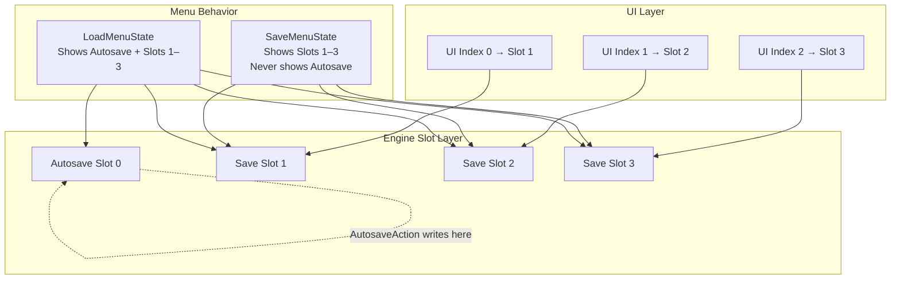

# Tuxemon Save System Architecture

This document defines how save slots, autosave, and UI slot mapping work in Tuxemon.  
It is the single source of truth for all save/load behavior.

---

## Slot Types

### UI-visible slots (1–3)
- Shown in SaveMenuState and LoadMenuState
- Mapped from UI indices 0–2
- User-controlled: save, overwrite, delete

### Autosave slot (0)
- Hidden in SaveMenuState
- Visible in LoadMenuState
- Never overwritten by user actions
- Written only by AutosaveAction

---

## Mapping Rules

| Operation | Rule |
|----------|------|
| UI index → save slot | `ui_to_save_index(i) = i + 1` |
| Save slot → UI index | `save_index_to_ui(s) = s - 1` |
| Event-action index | `resolve_save_index(i)` |
| UI selection | `slot_from_ui(i, includes_autosave)` |

---

## Menu Behavior

### SaveMenuState
- Displays slots 1–3
- Does not display autosave
- Cannot overwrite autosave

### LoadMenuState
- Displays autosave (slot 0) and slots 1–3
- Allows loading autosave
- Uses raw slot numbers

---

## Safety Guarantees

- Autosave cannot be overwritten by the player
- UI slots remain simple and predictable
- Load menu exposes all available save data
- Event actions always resolve to correct slot numbers

---

## File Layout

```
save_system/
    save_slots.py      # pure mapping helpers
    save_manager.py    # orchestrator for save/load/delete/render
    save_state.py      # save data model
    save.py            # serialization and file I/O
```

---

## Summary

The save system separates UI slots from the autosave slot to prevent accidental overwrites while keeping the UI simple. All slot mapping and safety rules are centralized in SaveManager and save_slots.

---

## Save System Diagram


